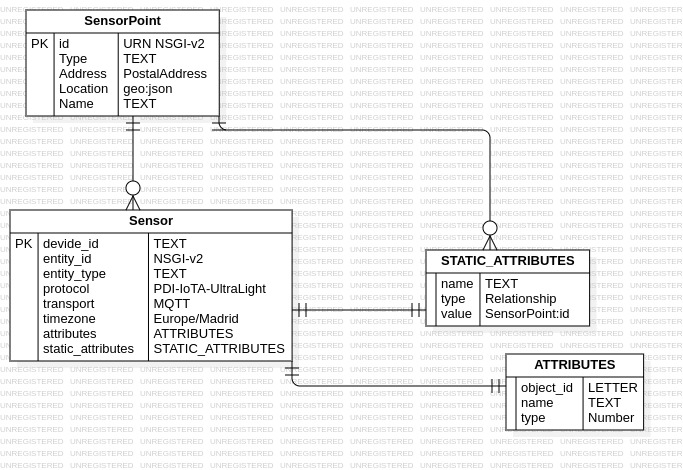
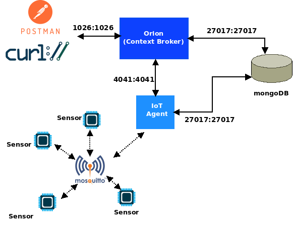

# DRI-FIWARE-MQTT
Este repositorio es el enunciado e implementación de la primera práctica que los alumnos de la asignatura Dispositivos y Redes Inalámbricos (DRI) deberán realizar con FIWARE.

## Objetivo
La práctica persigue que el alumno se familiarice con la plataforma FIWARE, en concreto con el módulo **Orion** de la misma, su interfaz REST API, así como con el agente MQTT. Además de con el empleo del estándar NGSI-v2 utilizado para la comunicación con los componentes de FIWARE.

Para ello se implementará un sistema en el que se simule la monitorización de temperatura y humedad de sensores desplegados en la ciudad de Albacete.

## Prerrequisitos
Es necesario que el alumno tenga instalado en su sistema:
* **Docker**
* **curl** o **Postman**. Usados para el envío de comandos a FIWARE utilizando su REST API.
* **Arduino IDE**. Este se emplea en el caso de utilizar dispositivos ESP32 o Arduinos para la implementación de los sensores
* **Python3**. En el caso de que los sensores sean simulados mediante _scripts_ de python.

## Enunciado de la práctica
Se deberá de realizar un despliegue utilizando FIWARE, en el que se reciban datos de sensores de temperatura y humedad desplegados en la ciudad de Albacete.

Estos sensores pueden ser implementados utilizando dispositivos ESP32 o Arduino, o bien simulados mediante _scripts_ de python. Cada sensor debe tener asociado a él unas coordenadas GPS "_[longitud, latitud]_", con las que poder situarlos geográficamente. Estas coordenadas pueden ser obtenidas a partir de un receptor GPS o bien simuladas. Las mediciones de humedad y temperatura se deberán enviar a la plataforma FIWARE pasado un periodo de tiempo especificado en el parámetro **T_MUESTREO**.

## Desarrollo de la práctica
### Definición de las entidades de datos
En esta sección indicaremos que entidades de datos vamos a definir, y cual será el contenido de cada entidad. Dicho modelo se puede ver en la figura siguiente:



De esta forma la especificación de dichas entidades de datos en JSON según el estándar NGSI-v2 sería:

* Para la especificación de un **Punto de Sensorización**:
```json
{
    "id": "urn:ngsi-ld:SensorPoint:001",
    "type": "SensorPoint",
    "address": {
        "type": "PostalAddress",
        "value": {
            "streetAddress": "Calle Marqués Molins, 9",
            "addressLocality": "Albacete",
            "addressCountry": "España",
            "postalCode": "02002"
        }
    },
    "location": {
        "type": "geo:json",
        "value": {
            "type": "Point",
            "coordinates": [38.994183727315956, -1.8541825028836005]
        }
    },
    "name": {
        "type": "Text",
        "value": "Sensor Point 001"
    },
}

```

* Y  para un **Sensor**:
```json
{
    "device_id": "Temp001",
    "entity_name": "urn:ngsi-ld:Temperature:001",
    "entity_type": "Temperature",
    "protocol": "PDI-IoTA-UltraLight",
    "transport": "MQTT",
    "timezone": "Europe/Madrid",
    "attributes":[
        {
            "object_id": "t",
            "name": "temperature",
            "type": "Number"}
    ],
    "static_attributes": [
        {
            "name": "refSensorPoint",
            "type": "Relationship",
            "value": "urn:ngsi-ld:SensorPoint:001"
        }
    ]
}
```


### Arquitectura del sistema
La arquitectura del sistema se puede ver en la siguiente figura:



Y está compuesta por:
* **Orion** que es el "_Context Broker_" de FIWARE que recibirá las peticiones NGSI-v2.
* Un **IoT Agent** cuya función es la:
    * subscribirse a los _topics_ del _broker_ MQTT relacionados con las mediciones de los sensores, para obtener dicha información
    * convertir la información obtenida del _broker_ MQTT en formato UltraLigth 2.0 al formato NSGI-v2, para enviársela a Orion.
* Una BB.DD **mongoDB** que es:
    * usada por Orion para almacenar la información de contexto del sistema. Las cual es modificada mediante las interacciones a través del protocolo NGSI-v2.
    * usada por el agente IoT para guardar información sobre dicho agente.
* Los sensores que se encargan de enviar la información al _broker_ MQTT en formato UltraLigth 2.0.
* La aplicación **cUrl** o **Postman** utilizada para la interacción del usuario con Orion.

### Docker-compose
La arquitectura anterior se despliega utilizando **docker-compose**, siendo el fichero de configuración [./docker-compose.yml](./docker-compose.yml). Además se emplea el fichero [./.env](./.env) para especificar las variables de entorno que se utilizan para la configuración de los contenedores.

#### Ejecución de la arquitectura
Para facilitar el lanzamiento de todos los componentes de la arquitectura, se ha creado un *shell script* [./services](./services) (comprobar derechos de ejecución) que permite la ejecución de todos los componentes de la arquitectura, excepto los sensores. Esto deberán ser lanzados/conectados de forma individual por el usuario.

Dicho *script* [./services](./services) utiliza el *script* [./import-data](./import-data) (debe tener permisos de ejecución) para definir en Onion los sensores, facilitando de esta forma la configuración inicial del sistema. El contenido de este fichero [./import-data](./import-data) se puede utilizar para definir más sensores dentro de Onion. Como se puede observar, en dicho [./import-data](./import-data) solo se realiza un POST a la URL [http://localhost:1026/v2/o/update](http://localhost:1026/v2/o/update) incluyendo en los datos del mensaje un JSON con la lista de SensorPoint que tenemos en nuestro sistema. La asignación, o especificación, de los sensores que están incluidos en cada SensorPoint se realiza una vez que se haya definido en el IoT-Agent el recurso para procesar los mensajes MQTT procedentes de los mismos. Esto se comentará en las secciones [Añadir servicio MQTT](#añadir-servicio-mqtt) y [Añadir sensores al sistema](#añadir-sensores-al-sistema).

Con estos *scripts* el lanzamiento inicial del sistema para la realización de la práctica es tan simple como ejecutar los siguientes comandos:

```sh
#!/bin/bash
git clone https://github.com/franciscodelicado/DRI-Fiware-MQTT.git
cd DRI-Fiware-MQTT

./services create ; ./services start
```

Para finalizar la ejecución del sistema simplemente hay que ejecutar:

```sh
#!/bin/bash
./services stop
```

#### Añadir servicio MQTT
Una vez que se ha levantado  mediante el comando ``` ./services start``` la arquitectura, e incluidos los SensorPoint en el sistema  (esto ya lo hace el comando ```./services start```, pero se pueden añadir manualmente utilizando una llamda similar a la que se realiza en el script [./import-data](./import-data)). Lo primero a realizar es la definición de cada uno de los servicios MQTT de que vamos a disponer. Para ello se envía al IoT-Agent el siguiente POST:

```sh
curl -i -X POST 'http://localhost:4041/iot/services' \
  -H 'Content-Type: application/json' \
  -H 'fiware-service: openiot' \
  -H 'fiware-servicepath: /' \
  -d '{
      "services":[
          {
              "apikey": "hfa4z89a5phzvp444dsb",
              "cbroker": "http://localhost:1026",
              "entity_type": "Thing",
              "resource":""
          }
      ]
  }'
```
Como se puede observar aquí se especifican dos parámetros en la cabecera (**-H**) del mensaje POST:
* ***fiware-service***: que se utilizará para determinar la BB.DD. de mongoDB que se utilizará para el almacenamiento de los datos. Luego se puede utilizar para seleccionar entre distintos departamentos.
* ***fiware-servicepath***: se utiliza para diferenciar entre arrays de dispositivos. Se puede utilizar para agrupar dispositivos de una mismo departamente (*fiware-service*).

En la parte de datos del POST hay que destacar lo siguiente:
* ***apikey***: es una clave que se utilizará para la generación del *topic* utilizado en el mensaje MQTT. Y sirve para que el IoT-Agent sepa diferenciar qué servicio debe procesar el mensaje. Además de ser una pseudo-clave de acceso.
* ***cbroker***: especifica la dirección del *broker* de Fiware, en este caso de Orion. Su valor por defecto es [http://localhost:1026](http://localhost:1026). Luego en este caso se podría haber obviado.
* ***entity_type***: indica el tipo de entidad que se está definiendo, y en nuestro caso podemos utilizar la genérica "*Thing*".
* ***resource***: esta en el caso de MQTT deberá permanecer en blanco. Solo es utilizado en el caso de utilizar HTTP para indicar el PATH, dentro de la URN, en el que se encuentra el recurso al que queremos acceder. Pero en MQTT, esto ya viene determinado directamente por el valor del *topic*.

#### Añadir sensores al sistema
PAra añadir un sensor al sistema solo hay que enviar un POST al IoT-Agent como el siguiente:

```sh
curl -iX PORT  'http://localhost:4041/iot/devices' \
  -H 'Content-Type: application/json' \
  -H 'fiware-service: openiot' \
  -H 'fiware-servicepath: /' \
  -d '{
      "devices": [
          {
              "device_id": "temp001",
              "entity_name": "urn:ngsi-ld:Temperature:001",
              "entity_type": "Temperature",
              "protocol": "PDI-IoTA-UltraLight",
              "transport": "MQTT",
              "timezone": "Europe/Madrid",
              "attributes":[
                  {
                      "object_id": "t",
                      "name": "temperature",
                      "type": "Number"}
              ],
              "static_attributes": [
                  {
                      "name": "refSensorPoint",
                      "type": "Relationship",
                      "value": "urn:ngsi-ld:SensorPoint:001"
                  }
              ]
          }
      ]
  }
```

Como se puede ver con los parámetros de cabecera ***fiware-service*** y ***fiware-servicepath***, especificamos el grupo de sensores al que queremos añadir dispositivos. 

Dentro del cuerpo de datos del mensaje POST, el JSON especifica:
* ***device_id***: es el identificador del dispositivo que se utilizará en la creación del *topic* para publicar/subscribirse a los datos de este dispositivo.
* ***protocol***: indica el protocolo utilizado en capa de datos entre el dispositivo y el *broker* (Orion). En este caso es UltraLight
* ***attributes***: es un array de atributos o medidas que se pueden enviar. Para cada *attribute* el campo ***object_id*** será el que se emplea en el protocolo UltraLight para indicar el *attribute* sobre que se envían datos. Y el campo ***type*** indica el tipo de dato que está asociado a dicho *attribute*
* ***static_attributes***: es un array de datos estáticos del dispositivo en concreto. En este caso se indica una *Relationship*, es decir, que este dispositivo está relacionado con el *SensorPoint* cuyo identificador es *urn:ngsi-ld:SensorPoint:001* (y que está definido en [./import-data](./import-data)).

### Envío de datos por los dispositivos

Dado que el *topic* para enviar un dato de un dispositivo al IoT-Agent debe seguir el formato ```/<protocol>/<apikey>/<device_id>/attrs```. Para el caso del dispositivo anteriormente dado de alta el *topic* sería:
```http
/ul/hfa4z89a5phzvp444dsb/temp001/attrs
```
donde se puede ver que ***ul*** es la especificación del protocolo UltraLight. 

Si quisiéramos enviar  un valor de *temperature* de 25.6 grados, el valor que deberíamos enviar es ```t|25.6```, puesto que el *object_id* del array de atributos es "t" y el valor a él asociado es numérico. De esta forma, y utilizando una imagen docker de un cliente MQTT ejecutaríamos el siguiente comando:

```sh
docker run -it --rm --name mqtt-publisher --network dri-fiware-mqtt_default efrecon/mqtt-client pub -h mosquitto -m "t|25.6" -t "/ul/hfa4z89a5phzvp444dsb/temp001/attrs"
```

Como se observa en el comando docker, se indica que la imagen debe ser levantada en la red *dri-fiware-mqtt_default* que es la especificada en el [docker-compose.yml](docker-compose.yml). Que el *host*, parámetro **-h**, al que se ataca es *mosquitto*, nombre que se le da a la imagen de docker con el servidor mosquitto (ver [docker-compose.yml](docker-compose.yml)), y el *topic* se indica en el parámetro **-t**, y el dato en el parámetro **-m**.

Para comprobar que este valor ha llegado al broker Orion se puede ejecutar realizar la siguiente petición a la API de Orion, que devuelve el último valor enviado de todos los dispositivos:

```sh
curl -iX GET 'http://localhost:1026/v2/entities/' \
  -H 'fiware-service: openiot' \
  -H 'fiware-servicepath: /'
```
La cual devuelve lo siguiente:

```json
[
  {
    "id": "urn:ngsi-ld:Temperature:001",
    "type": "Temperature",
    "TimeInstant": {
      "type": "DateTime",
      "value": "2023-10-19T16:54:43.486Z",
      "metadata": {}
    },
    "refSensorPoint": {
      "type": "Relationship",
      "value": "urn:ngsi-ld:SensorPoint:001",
      "metadata": {
        "TimeInstant": {
          "type": "DateTime",
          "value": "2023-10-19T16:54:43.486Z"
        }
      }
    },
    "temperature": {
      "type": "Number",
      "value": 25.6,
      "metadata": {
        "TimeInstant": {
          "type": "DateTime",
          "value": "2023-10-19T16:54:43.486Z"
        }
      }
    }
  }
]
```
Como se observa de la salida obtenida, la publicación anterior ha sido asignada al dispositivo con *device_id=temp001* como se puede ver del campo *refSensorPoint*. Y que el atributo *t* enviado en la publicación, usando el protocolo UltraLight, ha sido mapeado al atributo *temperature*. Los campos *TimeInstant* indican el tiempo en que se actualizó la información tanto de los atributos como de la entidad.

Indicar que el ***id*** que asocia el IoT-Agent al dispositivo anterior es ***urn:ngsi-ld:Temperature:temp001***, se obtiene del campo *<entity_name>* que se utilizaron cuando se dio de alta dicho dispositivo en el IoT-Agent. Utilizando dicho identificador podemos solicitar a Orion que solo nos envíe el último valor asociado a dicho dispositivo con la siguiente llamada:

```sh
curl -iX GET 'http://localhost:1026/v2/entities/urn:nsgi-ld:Temperature:temp001' \
 -H 'fiware-service: openiot' \
 -H 'fiware-servicepath: /' \
 -d 'type=Temperature'
 ```
Se obtiene la siguiente salida, qué es muy similar ya que solo se ha realizado el envío de datos de un solo dispositivos.

```json
{
  "id": "urn:ngsi-ld:Temperature:001",
  "type": "Temperature",
  "TimeInstant": {
    "type": "DateTime",
    "value": "2023-10-19T17:14:38.861Z",
    "metadata": {}
  },
  "refSensorPoint": {
    "type": "Relationship",
    "value": "urn:ngsi-ld:SensorPoint:001",
    "metadata": {
      "TimeInstant": {
        "type": "DateTime",
        "value": "2023-10-19T17:14:38.861Z"
      }
    }
  },
  "temperature": {
    "type": "Number",
    "value": 25.6,
    "metadata": {
      "TimeInstant": {
        "type": "DateTime",
        "value": "2023-10-19T17:14:38.861Z"
      }
    }
  }
}
```

Pero si añadimos un nuevo dispositivo, y enviamos datos desde él, se podrá observar la diferencia entre ambas salidas:

```sh
#!/bin/bash
## Añadimos un sensor de luminosidad
curl -iX PORT  'http://localhost:4041/iot/devices' \
  -H 'Content-Type: application/json' \
  -H 'fiware-service: openiot' \
  -H 'fiware-servicepath: /' \
  -d '{
      "devices": [
          {
              "device_id": "luminosity002",
              "entity_name": "urn:ngsi-ld:Luminosity:002",
              "entity_type": "Luminosity",
              "protocol": "PDI-IoTA-UltraLight",
              "transport": "MQTT",
              "timezone": "Europe/Madrid",
              "attributes":[
                  {
                      "object_id": "l",
                      "name": "luminosity",
                      "type": "Number"}
              ],
              "static_attributes": [
                  {
                      "name": "refSensorPoint",
                      "type": "Relationship",
                      "value": "urn:ngsi-ld:SensorPoint:002"
                  }
              ]
          }
      ]
  }'

# Publicamos valor para el sensor de luminosidad
docker run -it --rm --name mqtt-publisher --network dri-fiware-mqtt_default efrecon/mqtt-client pub -h mosquitto -m "l|1001" -t "/ul/hfa4z89a5phzvp444dsb/luminosity002/attrs"

# Obtenemos el ultimo valor publicado de todos los sensores
curl -G -X GET 'http://localhost:1026/v2/entities/' \
  -H 'fiware-service: openiot' \
  -H 'fiware-servicepath: /'
```
```json
[
    {
        "id": "urn:ngsi-ld:Luminosity:002",
        "type": "Luminosity",
        "TimeInstant": {
            "type": "DateTime",
            "value": "2023-10-26T15:41:05.882Z",
            "metadata": {}
        },
        "luminosity": {
            "type": "Number",
            "value": 1188.78,
            "metadata": {
                "TimeInstant": {
                    "type": "DateTime",
                    "value": "2023-10-26T15:41:05.882Z"
                }
            }
        },
        "refSensorPoint": {
            "type": "Relationship",
            "value": "urn:ngsi-ld:SensorPoint:002",
            "metadata": {
                "TimeInstant": {
                    "type": "DateTime",
                    "value": "2023-10-26T15:41:05.882Z"
                }
            }
        }
    },
    {
      "id": "urn:ngsi-ld:Temperature:001",
      "type": "Temperature",
      "TimeInstant": {
        "type": "DateTime",
        "value": "2023-10-19T17:14:38.861Z",
        "metadata": {}
      },
      "refSensorPoint": {
        "type": "Relationship",
        "value": "urn:ngsi-ld:SensorPoint:001",
        "metadata": {
          "TimeInstant": {
            "type": "DateTime",
            "value": "2023-10-19T17:14:38.861Z"
          }
        }
      },
      "temperature": {
        "type": "Number",
        "value": 25.6,
        "metadata": {
          "TimeInstant": {
            "type": "DateTime",
            "value": "2023-10-19T17:14:38.861Z"
          }
        }
      }
    }
]
```
Y si ahora lanzamos la petición:
```sh
curl -iX GET 'http://localhost:1026/v2/entities/urn:ngsi-ld:Temperature:001' \
 -H 'fiware-service: openiot' \
 -H 'fiware-servicepath: /' \
 -d 'type=Temperature'
 ```
solo obtenemos el valor asociado al sensor *urn:ngsi-ld:Temperature:001*.
```json
{
    "id": "urn:ngsi-ld:Temperature:001",
    "type": "Temperature",
    "TimeInstant": {
      "type": "DateTime",
      "value": "2023-10-19T17:14:38.861Z",
      "metadata": {}
    },
    "refSensorPoint": {
      "type": "Relationship",
      "value": "urn:ngsi-ld:SensorPoint:001",
      "metadata": {
        "TimeInstant": {
          "type": "DateTime",
          "value": "2023-10-19T17:14:38.861Z"
        }
      }
    },
    "temperature": {
      "type": "Number",
      "value": 25.6,
      "metadata": {
        "TimeInstant": {
          "type": "DateTime",
          "value": "2023-10-19T17:14:38.861Z"
        }
      }
    }
}
```

## Test
Para realizar un test rápido del funcionamiento del sistema se deberán realizar los siguientes pasos:
 
 1. Lanzar la arquitectura de servicios [Test 1](#test-1-lanzar-arquitectura-de-servicios).
 2. Configurar el IoT-Agent para poder recibir datos de los sensores[Test 2](#test-2-configurar-iot-agent).
 3. Dar de alta los sensores en el sistema [Test 3](#test-3-dar-de-alta-sensores).
 4. Poner en funcionamiento los sensores para que envíen datos al sistema [Test 4](#test-4-lanzar-sensores).
 5. Obtener los valores de contexto asociados a los sensores guardados en Orion [Test 5](#test-5-obtención-valores-contexto).

 A continuación veremos como realizar cada una de estas acciones:

 ### Test 1. Lanzar arquitectura de servicios.
 Siguiendo las instrucciones de la sección [Ejecución de la arquitectura](#ejecución-de-la-arquitectura), ejecutamos el siguiente comando:
 ```sh
 ./service start
 ```
 ### Test 2. Configurar IoT-Agent.
 La configuración del agente IoT-Agent se realiza según lo indicado en la sección [Añadir servicio MQTT](#añadir-servicio-mqtt). Se ha incluido el script [provision-devices.sh](./provision-devices.sh) que entre otras cosas realiza esta configuración para un ejemplo concreto

 ### Test 3. Dar de alta sensores.
Tras configurar el IoT-Agent se deben dar de alta en el sistema los sensores y actuadores con los que vamos a trabajar (sección [Añadir sensores al sistema](#añadir-sensores-al-sistema)). El script [./provision-devices.sh](./provision-devices.sh) realiza este alta para un ejemplo concreto.
 
 ### Test 4. Lanzar sensores.
 En este punto si los sensores fueran reales, y estuvieran programados acorde a la configuración con que se dieron de alta, el sistema estaría recibiendo datos de ellos. El script [./multiple-mqtt-client.py](./multiple-mqtt-client.py) simula el envío de datos aleatorios de los sensores dados de alta con el script [./provision-devices.sh](./provision-devices.sh). Pare ello hay que ejecutar el comando:
 ```sh
 python multiple-mqtt-client.py -f sensor-list.csv
 ```
 siendo el fichero [./sensor-list.csv](./sensor-list.csv), un fichero CSV separado por `;` en el que se indican los parámetros necesarios para la simulación de los sensores asociados al ejemplo lanzado por el script [./provision-devices.sh](./provision-devices.sh). La estructura de este fichero es la siguiente:
 ```csv
 <api_key>;<device_id>;<statistic>;<min_value>;<max_value>
 ```
donde:
  * `<api_key>`:  es una cadena formada por una combinación aleatoria de números y letras en minúsculas que representa la `api_key` utilizada en la configuración en el IoT-Agent.
  * `<device_id>`: es una cadena de caracteres que representa el identificador del sensor a simular
  * `<statistic>`: es un caracter que representa el `objet_id` del `atribute` asociado al sensor a simular.
  * `<min_value>` y `<max_value>`: son dos valores numéricos que tienen que cumplir que <min_value> < <max_value>, y que representan los límites entre los que se generará el valor aleatorio sensorizado.

Un ejemplo se muestra a continuación:
```csv
hfa4z89a5phzvp444dsb;temp001;t;10.5;25.6
hfa4z89a5phzvp444dsb;temp002;t;10.5;25.6
hfa4z89a5phzvp444dsb;temp003;t;10.5;25.6
hfa4z89a5phzvp444dsb;temp004;t;10.5;25.6
hfa4z89a5phzvp444dsb;luminosity001;l;1023;2013
hfa4z89a5phzvp444dsb;luminosity002;l;1023;2013
hfa4z89a5phzvp444dsb;luminosity003;l;1023;2013
```

Una vez lanzado el script de python,, si queremos ver todos los mensajes MQTT que se están recibiendo, nos podemos subscribir al *topic* `"/#"` en el broker MQTT que están utilizando dichos sensores. Para ello ejecutamos un docker del cliente de mosquitto de la siguiente forma:
```sh
docker run -it --rm --name mqtt-subscriber --network dri-fiware-mqtt_default efrecon/mqtt-client sub -v -h mosquitto -t "/#"
```
**OJO**: 
* El valor del parámetro `--network`, está formada por el valor de la variable `COMPOSE_PROJECT_NAME` del fichero [./.env](./.env), y del valor del parámetro `network` en la configuración de las imágenes del fichero [./docker-compose.yml](./docker-compose.yml). La lista de redes virtuales usadas por las imágenes de docker se pueden obtener con el comando: `docker network ls`
* El parámetro `-h` toma el valor del parámetro `hostname` asociado a la imagen de docker de mosquitto especificada el fichero [./docker-compose.yml](./docker-compose.yml).

### Test 5. Obtención valores contexto
Ahora para obtener los valores de contexto guardados en Orion, lo primero que podremos hacer es ver de que dispositivos (sensores) se está guardando contexto. Estos serán los que se hayan dado de alta en el sistema. Para ello ejecutamos la siguiente llamada a la API de Orion:
```sh
curl -s -X GET 'http://localhost:4041/iot/devices' \
  -H 'fiware-service: openiot' \
  -H 'fiware-servicepath: /'
```
Obteniendo el siguiente resultado:
```json
{
    "count": 7,
    "devices": [
        {
            "device_id": "temp002",
            "apikey": "hfa4z89a5phzvp444dsb",
            "service": "openiot",
            "service_path": "/",
            "entity_name": "urn:ngsi-ld:Temperature:002",
            "entity_type": "Temperature",
            "transport": "MQTT",
            "attributes": [
                {
                    "object_id": "t",
                    "name": "temperature",
                    "type": "Number"
                }
            ],
            "lazy": [],
            "commands": [],
            "static_attributes": [
                {
                    "name": "refSensorPoint",
                    "type": "Relationship",
                    "value": "urn:ngsi-ld:SensorPoint:002"
                }
            ],
            "protocol": "PDI-IoTA-UltraLight",
            "explicitAttrs": false
        },
...,
        {
            "device_id": "luminosity003",
            "apikey": "hfa4z89a5phzvp444dsb",
            "service": "openiot",
            "service_path": "/",
            "entity_name": "urn:ngsi-ld:Luminosity:003",
            "entity_type": "Luminosity",
            "transport": "MQTT",
            "attributes": [
                {
                    "object_id": "l",
                    "name": "luminosity",
                    "type": "Number"
                }
            ],
            "lazy": [],
            "commands": [],
            "static_attributes": [
                {
                    "name": "refSensorPoint",
                    "type": "Relationship",
                    "value": "urn:ngsi-ld:SensorPoint:003"
                }
            ],
            "protocol": "PDI-IoTA-UltraLight",
            "explicitAttrs": false
        }
    ]
}
```
Que como se puede ver es una lista que describe a 7 dispositivos sensores.

Seleccionando uno de ellos, podremos saber cual es el último valor de contexto asociado al mismo mediante la siguiente llamada a la API de Orion:
```sh
curl -sG -X GET "http://localhost:1026/v2/entities/urn:ngsi-ld:Temperature:002" \
  -H 'fiware-service: openiot' \
  -H 'fiware-servicepath: /' \
  -d 'type=Temperature'
```
con lo que obtenemos la siguiente información:
```json
{
  "id": "urn:ngsi-ld:Temperature:002",
  "type": "Temperature",
  "TimeInstant": {
    "type": "DateTime",
    "value": "2023-10-26T16:31:13.360Z",
    "metadata": {}
  },
  "refSensorPoint": {
    "type": "Relationship",
    "value": "urn:ngsi-ld:SensorPoint:002",
    "metadata": {
      "TimeInstant": {
        "type": "DateTime",
        "value": "2023-10-26T16:31:13.360Z"
      }
    }
  },
  "temperature": {
    "type": "Number",
    "value": 16.23,
    "metadata": {
      "TimeInstant": {
        "type": "DateTime",
        "value": "2023-10-26T16:31:13.360Z"
      }
    }
  }
}
```

## Bibliografía
[1] FIWARE, "NGSI-v2 Smart Supermarket Tutorials". On line [https://fiware-tutorials.readthedocs.io/en/latest/](https://fiware-tutorials.readthedocs.io/en/latest/) (Último acceso 06/10/2023).